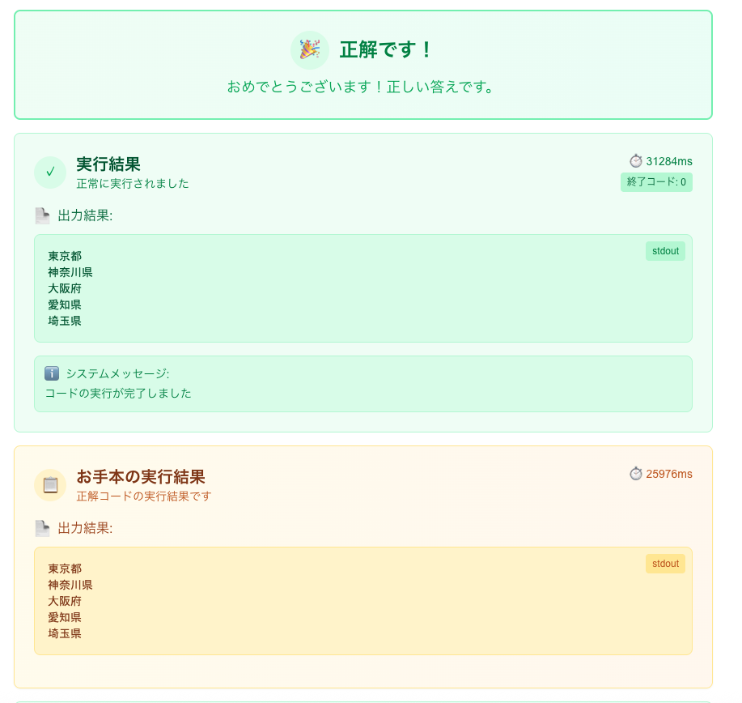
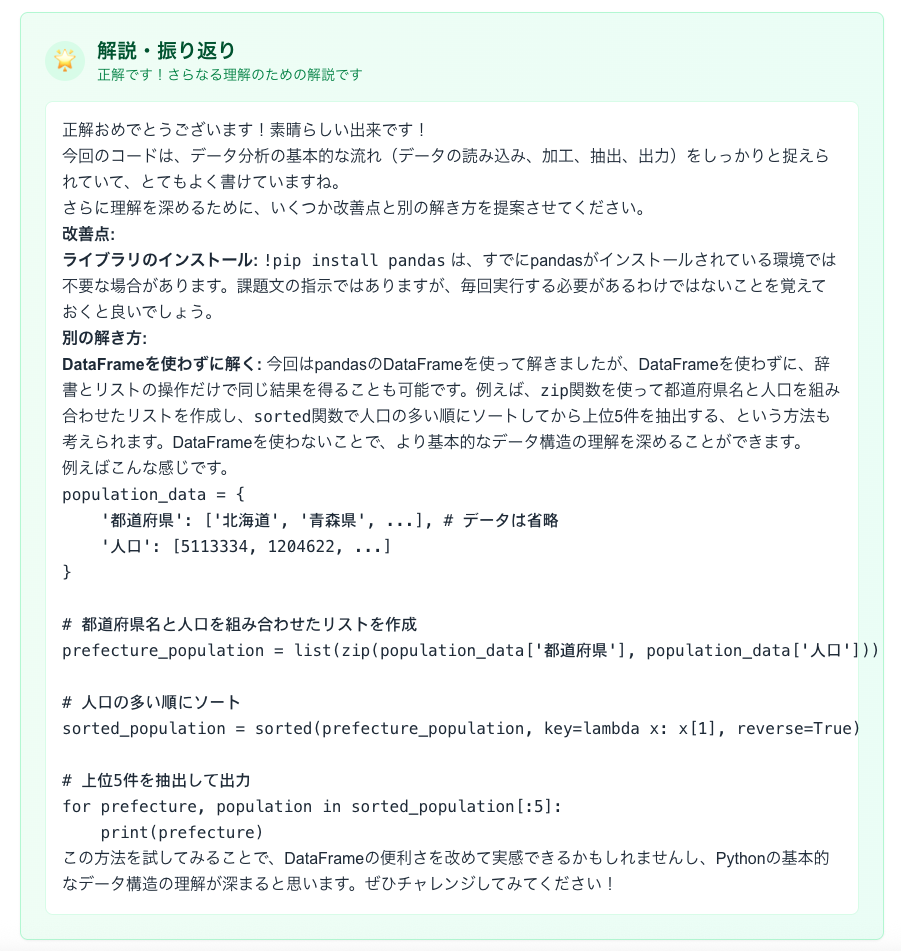
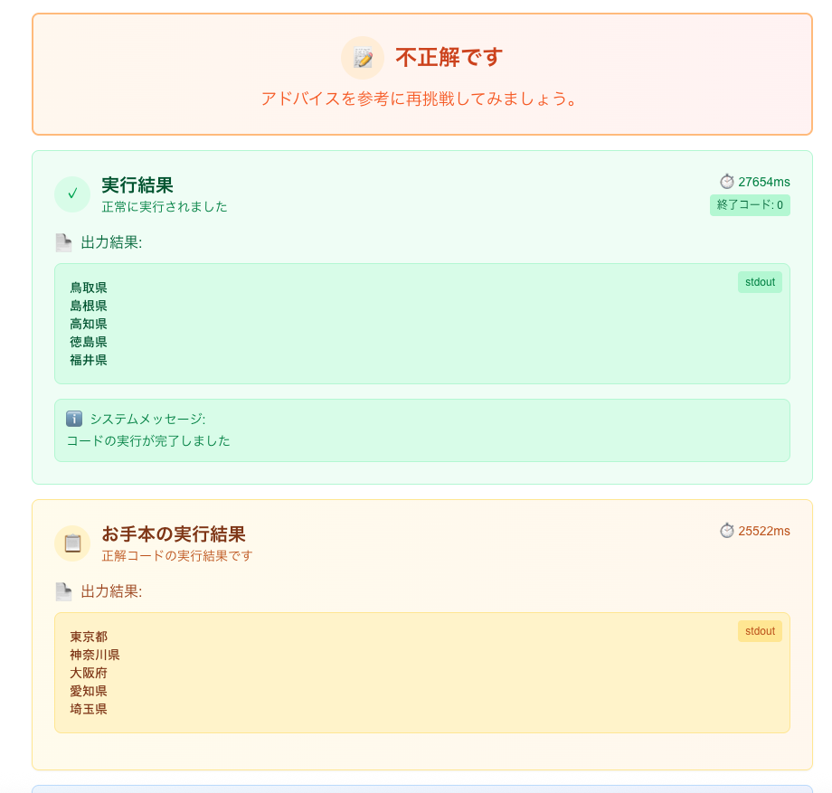
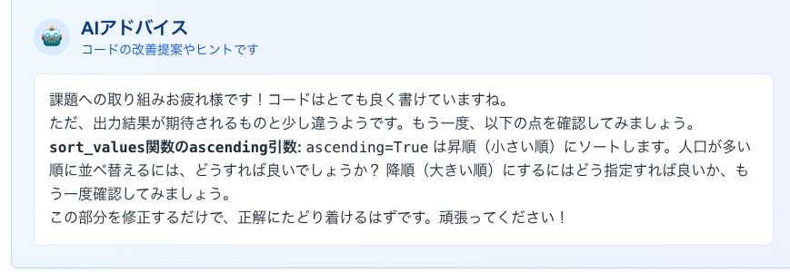

# 最終課題レポート

## 概要

本リポジトリでは、Python プログラミング課題に取り組む受講生が自分のコードを提出すると、自動でアドバイスを返す Web アプリケーションを実装しました。講座の宿題に対して "正解／不正解" だけではなく、どこを直せば良いかを学習者が考えられるようなヒントを提示することが目的です。

## 目的

- GCI 講座の宿題で、受講生がつまずいた箇所を素早く把握し、自力で改善できるよう支援する
- 添削者の負担を軽減しつつ、教育的なフィードバックを提供する
- チート行為を防止し、学習意欲を高める

## システム構成

- **フロントエンド:** Next.js 15 + TypeScript
- **バックエンド:** FastAPI / SQLAlchemy
- **コード実行:** Docker コンテナによるサンドボックス 
- **AI アドバイス生成:** LLM (Google GenAI) を利用
- **データベース:** SQLite

## 工夫した点

1. **安全なコード実行**
   - Docker コンテナを用いることで、提出コードによるシステムへの影響を最小化しました。
   - Python スクリプトだけでなく Jupyter Notebook 形式の提出にも対応し、ノートブックから Python コードを抽出して実行します。

2. **自動正解判定**
   - 正解コードと提出コードの出力を比較し、自動で正解かどうかを判定するようにしました。
   - コード内の```!pip install PACKAGE_NAME``` というコードを自動で認識し、その外部ライブラリを自動でインストールすることで、外部ライブラリを用いたコードの正解かどうかもテストできるようにしました。
3. **答えを教えないアドバイス**
   - プロンプトで「正解を直接教えない」ことを明示し、学習者がヒントから自分で考えられるようにしています。
   - その他アドバイスのポイントを細かく指定し、また、正解かどうかの結果、課題の情報、提出者のコード等必要な情報を含めることで、より良い出力が得られるようにプロンプトを工夫しました。
   
   **プロンプト**
   ```
   【判定結果】
   {"正解です！素晴らしい！" if is_correct else "不正解です。"}

   あなたは、Pythonプログラミングを学ぶ初学者をサポートする親切なAIアシスタントです。
   以下の情報に基づいて、学習者が自分で間違いに気づき、解決できるようになるためのヒントやアドバイスを生成してください。

   【重要】
   - **絶対にコードの正解そのものを直接教えてはいけません。**
   - 指摘は具体的かつ建設的に行い、学習者のモチベーションを維持するよう努めてください。
   - 難しい専門用語は避け、分かりやすい言葉で説明してください。
   - アドバイスは日本語でお願いします。
   {"- 正解の場合は、コードの改善点や別の解き方などを提案してください。" if is_correct else ""}

   【課題情報】
   タイトル: {problem_title}
   問題文:
   {problem_description}

   【学習者の提出コード】

   {user_code}


   【コードの実行結果】
   標準出力:
   {execution_stdout if execution_stdout else "なし"}
   標準エラー:
   {execution_stderr if execution_stderr else "なし"}

   【アドバイスのポイント】
   1.  **エラーがある場合:**
      - エラーメッセージ ({execution_stderr}) が何を意味するのか、考えられる原因は何かを優しく説明してください。
      - エラーが発生している箇所を特定するためのデバッグ方法（例: print文の挿入箇所など）を提案してください。
   2.  **エラーがないが期待通りに動作しない場合 (または改善点がある場合):**
      - コードのロジックで改善できる点や、より効率的な書き方があれば示唆してください。
      - 変数名やコメントの付け方など、読みやすいコードにするための一般的なアドバイスも適宜含めてください。
      - (もし正解コードが提供されていれば、それを直接見せるのではなく、学習者のコードとの違いからヒントを得られるような問いかけをしてください)
   3.  **よくある間違いの指摘:**
      - 初学者が陥りやすい間違いのパターンに合致する場合は、それとなく教えてあげてください。
         (例: for文の範囲、インデックスエラー、無限ループの可能性など)

   ```
4. **CI/CD とテスト**
   - Docker イメージのビルドと API の動作を GitHub Actions で自動テストできるよう構成しています。
5. **コストと性能を両立させたモデル選定**
   - モデルとしてはGemini2.0 Flashを採用しました。オープンソースのモデルも検討しましたが、日本語性能とコーディング性能を両立したものが少なく、またローカルで実装せずinference providerを使用すると無料枠を超えた場合に料金がかかってしまうので、無料枠が大きくかつ性能、コストも抑えたGoogle AI StudioのAPIを採用しました。
6. **管理画面の作成**
   - 運営が使用する課題の管理画面も作成し、タイトル、問題の説明、正解コード、標準入力（必要な場合）を入力することで、課題を作成することができるようにしました。jupyter notebookやpythonのコードをアップロードするだけで正解コードを登録できるようにしました。

## 使い方

1. `docker-compose up --build` を実行してフロントエンド (http://localhost:3000) とバックエンド API (http://localhost:8000) を起動します。
2. (http://localhost:3000)にアクセスします。
3. 受講生はブラウザ上のエディタでコードを提出すると、サンドボックスで実行され、結果をもとに AI がアドバイスを生成します。

## 課題提出画面の実際の挙動




## 今後の課題
- Bedrock など複数のモデルを切り替えられるよう改良し、コスト試算を自動化する
- 本番運用に向けたセキュリティ設定の強化

